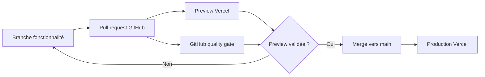

# CI/CD — TrippieMe

Dernière mise à jour : 8 août 2026.

## État vérifié

| Élément | Valeur |
| --- | --- |
| Vercel team | `faugeras-projects` |
| Projet Vercel | `trippieme-london` (`prj_bzIqjlW2BM0YJ05tpElcMheAha2M`) |
| Production | [trippieme-london.vercel.app](https://trippieme-london.vercel.app) |
| Runtime Node configuré | `24.x` |
| Dernier déploiement vu | `READY`, cible `production` |
| Dépôt attendu | `faugera/trippieme_v2` |
| État GitHub constaté | Le code source complet est versionné sur `main`. |
| Base de données cible | Neon Postgres (free tier) |
| ORM | Drizzle |
| Authentification | Better Auth (email / mot de passe) |

## Flux cible recommandé

Vercel Git Integration assure le déploiement. Le workflow GitHub Actions `.github/workflows/quality.yml` sert uniquement de garde-fou qualité : il ne redéploie jamais l’application.



1. Créer une branche de fonctionnalité depuis `main`.
2. Ouvrir une pull request vers `main`.
3. Vérifier l’URL Preview créée par Vercel et le workflow GitHub **Quality gate**.
4. Fusionner uniquement après validation ; Vercel crée alors le déploiement de production automatiquement.

## Contrôles obligatoires avant merge

```bash
npm ci
npm run typecheck
npm run lint
npm run build
npm audit --omit=dev
```

Le build Vercel doit utiliser `npm run build`. Les routes IA exigent une variable serveur présente dans chaque environnement nécessaire.

## Variables d’environnement Vercel

| Variable | Requise | Portée | Usage |
| --- | --- | --- | --- |
| `GEMINI_API_KEY` | Oui | Preview + Production | Génération et modification d’itinéraires |
| `GEMINI_MODEL` | Non | Preview + Production | Surcharge du modèle ; défaut : `gemini-2.5-flash` |
| `DATABASE_URL` | Oui | Preview + Production | Chaîne Neon Postgres, injectée par l’intégration Vercel Neon |
| `BETTER_AUTH_SECRET` | Oui | Preview + Production | Secret Better Auth, 32 octets minimum |
| `BETTER_AUTH_URL` | Oui | Production | `https://trippieme-london.vercel.app` |
| `BETTER_AUTH_TRUSTED_ORIGINS` | Oui | Preview + Production | Liste d’origines de confiance séparées par des virgules |

Ne jamais les committer, les coller dans un ticket, ni les exposer via `NEXT_PUBLIC_*`.

## Mise en service : Neon + Better Auth

1. Dans Vercel, ouvrir **Storage → Create → Neon** sur `trippieme-london`, sélectionner le free tier puis connecter la base aux environnements Preview et Production.
2. Vérifier que `DATABASE_URL` est bien injectée dans les deux environnements.
3. Générer un secret et l’ajouter dans Vercel, sans l’afficher :

```bash
node -e "process.stdout.write(require('node:crypto').randomBytes(32).toString('base64url'))"
```

4. Ajouter `BETTER_AUTH_URL=https://trippieme-london.vercel.app` en production ; ajouter les URL de Preview nécessaires dans `BETTER_AUTH_TRUSTED_ORIGINS`.
5. Pull des variables, générer puis appliquer la migration depuis une machine autorisée :

```bash
vercel env pull .env.local --yes
npm run db:generate
npm run db:migrate
```

6. Déployer une Preview et créer un compte avec l’action **Se connecter**. Un itinéraire créé ou modifié après connexion est alors synchronisé côté serveur via `/api/trips`.

`db:migrate` doit toujours être exécuté avant de promouvoir un changement de schéma. Il n’est volontairement pas exécuté depuis Vercel pendant le build.

## Exploitation et rollback

| Besoin | Action |
| --- | --- |
| Vérifier la production | Ouvrir l’URL de production et contrôler le déploiement `READY` dans Vercel |
| Lire erreurs API | Vercel > Observability > Runtime Errors, filtrer `/api/trips/generate` et `/api/trips/edit` |
| Tester sans risque | Utiliser l’URL Preview d’une pull request |
| Revenir en arrière | Vercel > Deployments > choisir le dernier déploiement sain > **Promote to Production** |
| Révoquer une clé | Google AI Studio, puis remplacer la variable Vercel et redéployer |

## État de référence

`main` est la source de vérité de l’application. Toute correction doit partir d’une branche, être vérifiée sur Preview Vercel, puis fusionnée vers `main`.
