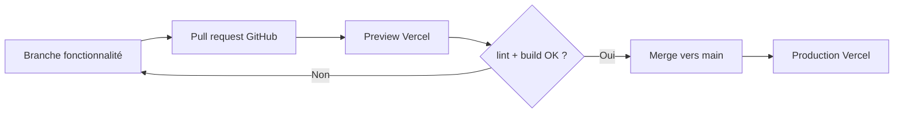

# CI/CD — TrippieMe

Dernière mise à jour : 8 août 2026.

## État vérifié

| Élément | Valeur |
| --- | --- |
| Vercel team | `faugeras-projects` |
| Projet Vercel | `trippieme-london` (`prj_bzIqjlW2BM0YJ05tpElcMheAha2M`) |
| Production | [trippieme-london.vercel.app](https://trippieme-london.vercel.app) |
| Runtime Node configuré | `24.x` |
| Dernier déploiement vu | `READY`, cible `production` |
| Dépôt attendu | `faugera/trippieme_v2` |
| État GitHub constaté | Le code source complet est versionné sur `main`. |

## Flux cible recommandé

Vercel Git Integration suffit pour ce projet Next.js : aucun workflow GitHub Actions de déploiement n’est nécessaire.



1. Créer une branche de fonctionnalité depuis `main`.
2. Ouvrir une pull request vers `main`.
3. Vérifier l’URL Preview créée par Vercel et les contrôles ci-dessous.
4. Fusionner uniquement après validation ; Vercel crée alors le déploiement de production automatiquement.

## Contrôles obligatoires avant merge

```bash
npm ci
npm run typecheck
npm run lint
npm run build
npm audit --omit=dev
```

Le build Vercel doit utiliser `npm run build`. Les routes IA exigent une variable serveur présente dans chaque environnement nécessaire.

## Variables d’environnement Vercel

| Variable | Requise | Portée | Usage |
| --- | --- | --- | --- |
| `GEMINI_API_KEY` | Oui | Preview + Production | Génération et modification d’itinéraires |
| `GEMINI_MODEL` | Non | Preview + Production | Surcharge du modèle ; défaut : `gemini-2.5-flash` |

Ne jamais les committer, les coller dans un ticket, ni les exposer via `NEXT_PUBLIC_*`.

## Exploitation et rollback

| Besoin | Action |
| --- | --- |
| Vérifier la production | Ouvrir l’URL de production et contrôler le déploiement `READY` dans Vercel |
| Lire erreurs API | Vercel > Observability > Runtime Errors, filtrer `/api/trips/generate` et `/api/trips/edit` |
| Tester sans risque | Utiliser l’URL Preview d’une pull request |
| Revenir en arrière | Vercel > Deployments > choisir le dernier déploiement sain > **Promote to Production** |
| Révoquer une clé | Google AI Studio, puis remplacer la variable Vercel et redéployer |

## État de référence

`main` est la source de vérité de l’application. Toute correction doit partir d’une branche, être vérifiée sur Preview Vercel, puis fusionnée vers `main`.
